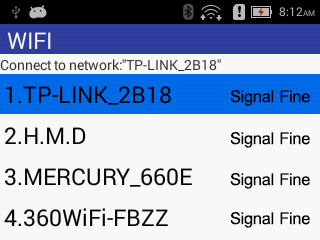

### Network Configuration Steps

1.Select [ 4. Settings] on the main menu page.；

2.Enter the authorization password on the [Administrator Password Authentication] page. The authorization password defaults to the number 123456 and press the [Confirm] button.

3.In the [Settings] interface, you can select [2.WIFI] to enter the WIFI list display interface, as shown below.：

            Fig. 3-1 WIFI List display interface

According to the actual situation Users can use "Up"or "Down"Select the name of the WIFI hotspot to be connected, and press the [Enter] key.
Enter the [Select Network] interface, enter the password of this WIFI hotspot, if the WIFI password contains letters, use "Up"to switch, for example: if the WIFI password contains the letter "z", first press the number key "1" containing the changed letter, After pressing "Up" the display area will display “Q”, press "Up"continuously, until that the display area displays the letter “z”, and the input method of other letters is similar;

4.In the [Settings] interface, you can also select [3. Mobile Data] to connect to the Internet.

