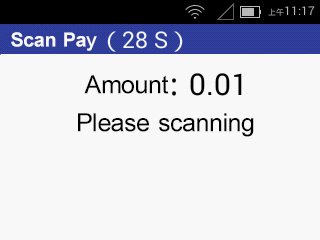

### Terminal Transaction Flow（B To C）

1.Select [1. Gathering] on the main menu page;

2.Enter the amount on the [Scanning Code Payment] page and press the [Confirm] button to enter the scanning code operation page;

              Fig. 6-1 Transaction Interface

At this point, the customer can present Alipay, WeChat, UnionPay cloud flash payment (optional), and the S1 scan code terminal completes the scan code transaction process.

