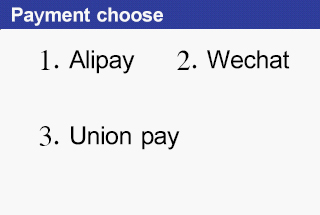

###Terminal Transaction Flow（C To B）

1.Select [5. Be swept] on the main menu page;

2.Enter the amount on the [Scanned Payments] page and press the [Confirm] button to enter the [Payment Channel Selection] page;

            Fig. 7-1 Payment channel selection page

3. Take Alipay as an example, select [1. Alipay] on the [Payment Channel Selection] interface, and enter the “Pending Payment” interface. as follows：

               Fig. 7-2 paying interface

The customer uses the "Alipay" client to "scan" the scan code interface, scan the two-dimensional code of the above "to be paid" interface, and complete the payment transaction process by the customer "Alipay" client;

